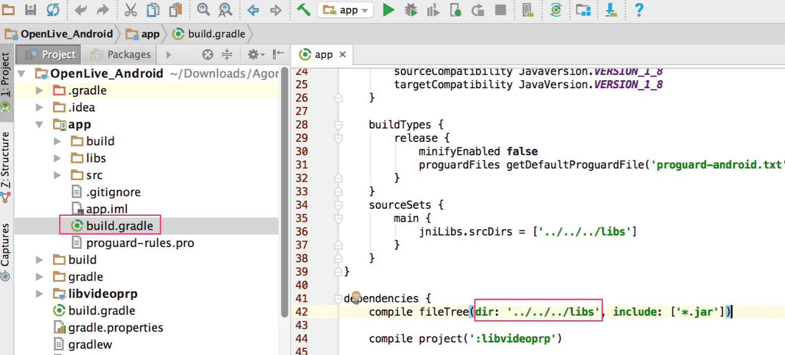
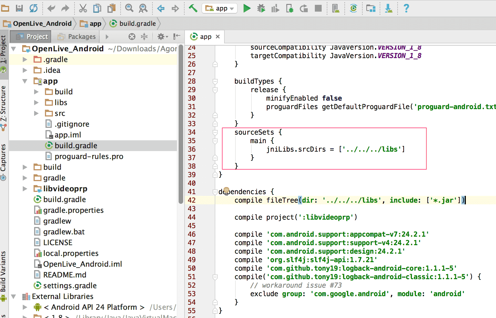
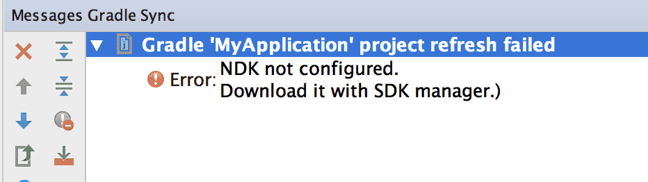
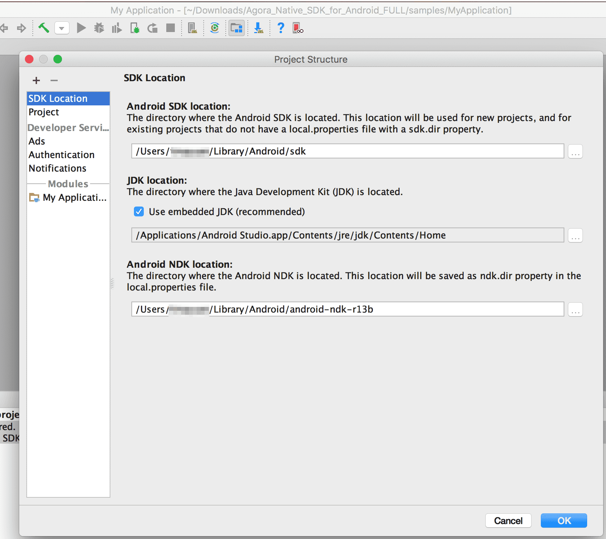
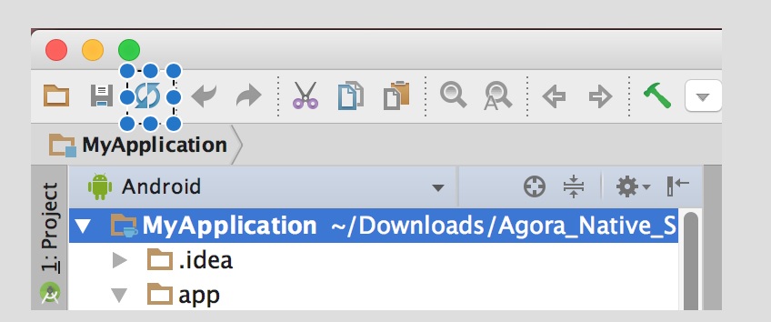

# 在线合唱：从方案到集成

Other Language: [English](README.md)

声网 SDK 提供在线合唱解决方案，主要包括:

* 场景描述
* 实现方案
* 集成方法
* 常见问题
* 进阶指南

## 场景描述

* 发起人点歌，并发起合唱；
* 音乐播放端通过网络同时发送给多位合唱者；
* 合唱者在线合唱，并能同步听到彼此的声音；

# 实现方案

下图为在线合唱场景的实现架构图：

     


在这个架构图中：

* 音乐播放器端加入 SD-RTN；
* 伴奏音乐通过 SD-RTN 实时同步发送给合唱者 A 和 B；
* 合唱者 A 和 B 会同时听到伴奏，合着伴奏开始演唱；
* SD-RTN 会实时地将 A 的歌声传给 B 端，同样的 B 的歌声也会被实时地传输到 A 端；

声网已在 GitHub 提供了 Android 平台的 [实现代码](https://github.com/AgoraIO-Community/Agora-Online-Chorus/tree/master/Agora-Online-Chorus-Android) 。


## 集成方法

### 集成 SDK

#### 步骤 1：准备环境

1. 联系声网商务下载 Android 平台合唱 SDK。详情请洽 sales@agora.io ，电话 4006326626。

2. 请确保满足以下开发环境要求:

    * Android SDK API Level> = 16

    * Android Studio 2.0 或以上版本

    * 支持语音和视频功能的真机

    * App 要求 Android 4.1 或以上设备

3. 请确保在使用 Agora 相关功能及服务前，已打开特定端口，详见 :doc:`../Agora Platform/firewall`。


#### 步骤 2: 添加 SDK

1. 将下载的软件包中 *libs* 文件夹下的库根据实际需求拷贝到您项目对应的文件夹里。

   * agora-rtc-sdk.jar (mandatory)

   * armeabi-v7a/

   * x86/

   * arm64-v8a

**注意:** 当你将所需库复制到正确路径的 *libs* 文件夹里时，如果该路径包含中文，则无法成功编译，报错中会提到 ASCII 码。

2. 请根据您项目的 *build.gradle* 文件里的设置，将上述库放入正确路径的 *libs* 文件夹下。例如:

     


3. 请在 build.gradle 文件里指定 so 文件的目录，即上一步里面 libs 文件夹的路径。

     

#### 步骤 3: 配置 NDK

如果出现以下问题，请配置 NDK:

     


该错误表示没有安装 NDK。请从网站上下载，请将其放在与 Android SDK 平行的路径下:

     


#### 步骤 4: 添加权限

为保证 SDK 正常运行，程序部署时需在 *AndroidManisfest.xml* 文件中加入以下许可：

```
   <uses-permission android:name="android.permission.INTERNET" />

   <uses-permission android:name="android.permission.RECORD_AUDIO" />

   <uses-permission android:name="android.permission.MODIFY_AUDIO_SETTINGS" />

   <uses-permission android:name="android.permission.ACCESS_NETWORK_STATE" />
```

#### 步骤 5：同步项目文件

点击 **Sync Project With Gradle Files** ，直到同步完成。

     


#### 步骤 6：混淆代码

当您在写混淆代码时，请添加以下代码:

     

### 加入声网频道实现音频通话

首先申请 App ID，详见 :ref:`app_id_native`。

#### 音乐播放端

1. 创建 RtcEngine 对象，并填入 App ID，详见 :ref:`communication_android_create`。

 ```

   public static synchronized RtcEngine create(Context context,
                                                String appId,
                                                IRtcEngineEventHandler handler);
 ```

2. 设置频道为通信模式，详见 :ref:`communication_android_setChannelProfile`。

 ```
   public abstract int setChannelProfile(int profile);
 ```
3. 创建并加入频道, 详见 :ref:`communication_android_joinchannel`。

 ```

   public abstract int joinChannel(String token,
                                   String channelName,
                                   String optionalInfo,
                                   int optionalUid);
 ```

4. 开始播放伴奏，详见 :ref:`communication_android_startAudioMixing`

 ```

   public abstract int startAudioMixing(String filePath,
                                        boolean loopback,
                                        boolean replace,
                                        int cycle);
 ```

5. 离开频道 (leaveChannel)，详见 :ref:`communication_android_leaveChannel`

 ```

   public abstract int leaveChannel();

 ```
**注意:** 伴奏音量应小于人声。

6. 离开频道，详见 :ref:`communication_android_leaveChannel`。

#### 歌手端

1. 创建 RtcEngine 对象，并填入 App ID，详见 :ref:`communication_android_create`。

 ```

   public static synchronized RtcEngine create(Context context,
                                                String appId,
                                                IRtcEngineEventHandler handler);
 ```

2. 设置频道为通信模式，详见 :ref:`communication_android_setChannelProfile`。

 ```

   public abstract int setChannelProfile(int profile);

 ```
3. 为歌手端设置低延时策略：

 ```

   mRtcEngine.setParameters("{\"che.audio.enable.androidlowlatencymode\": true}");
   mRtcEngine.setParameters("{\"che.audio.enable.androidlowlatencymode\": true}");
   mRtcEngine.setParameters("{\"che.audio.start_debug_recording\":\"111\"}");
   mRtcEngine.setParameters("{\"che.audio.codec.name\":\"OPUSFB\"}");
   mRtcEngine.setParameters("{\"rtc.resend_lowlatency\":1}");
   mRtcEngine.setParameters("{\"che.audio.neteq.maxdelay\":20}");
   mRtcEngine.setParameters("{\"che.audio.neteq.mindelay\":0}");

 ```
4. 创建并加入频道, 详见 :ref:`communication_android_joinchannel`。

 ```

   public abstract int joinChannel(String token,
                                   String channelName,
                                   String optionalInfo,
                                   int optionalUid);
 ```
5. 离开频道 (leaveChannel)，详见 :ref:`communication_android_leaveChannel`

 ```

   public abstract int leaveChannel();

 ```

## 常见问题

### 弱网情况下人声有卡顿

为了保证合唱的实时性，歌手客户端采用了低延时策略，弱网下丢包率会相应增加。

#### 出现回声

歌手需要带耳机合唱，不能通过外放。


## 进阶指南

### 耳返接口:

- 启用耳返功能, 详见 :ref:`enableInEarMonitoring_live_Android` 。
- 设置耳返音量，相见 :ref:`setInEarMonitoringVolume_live_Android`  。

### 调整伴奏音量：

- 启用耳返功能，详见 :ref:`enableInEarMonitoring_live_Android` 。
- 设置耳返音量，相见 :ref:`setInEarMonitoringVolume_live_Android` 。

### 调整伴奏音量：

音乐播放端直接调整音量，详见 :ref:`communication_android_adjustAudioMixingVolume`。
